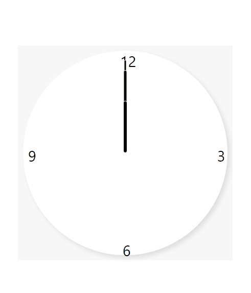

# 아날로그 시계 구현

### 구동 화면

### 라이브러리

1. React
2. Redux
3. Typescript
4. Styled-components

### 구현 상세

1. 현재 시간
2. 시침 분침 초침
3. 마우스 오버 시 마우스 위치 추적
4. 지정 위치에 맞춰 업데이트되는 툴팁

### 상태 관리를 이용해 관리할 목록

1. 현재 시간
2. 마우스 위치
